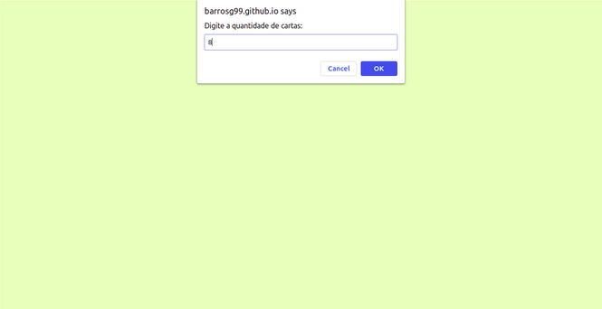
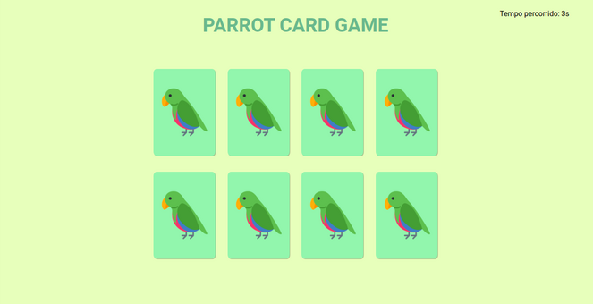
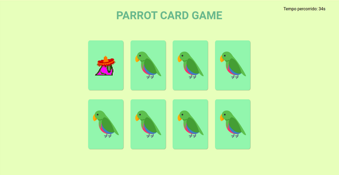
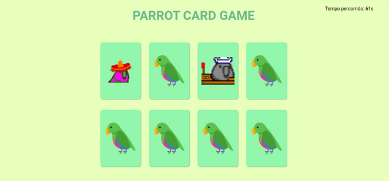
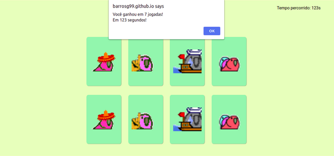

# Parrot Card Game

Parrot Card Game, um site feito com HTML, CSS e JS com objetivo de ser um jogo da memória criando o HTML através do JS.

DEMO: https://barrosg99.github.io/parrot-card-game

## Features

✅ Monta o tabuleiro de maneira aleatória com base no número de cartas informadas pelo usuário, max: 14

✅ Ao clicar na carta, ela vira e mostra o papagaio que está atrás

✅ Ao clicar na segunda carta, se ela for igual a primeira, fica virada até o fim do jogo, se não for, as cartas ficam viradas por 1 segundo e depois voltam para o estado inicial.

✅ Após encontrar todos os pares, o jogo acaba e mostra quantas jogadas você fez e o tempo que levou para terminar.

✅ Pergunta se o jogador quer jogar novamente, se sim o tabuleiro reseta, se não, nada acontece.

## Como rodar o projeto?

1. Clone o projeto
2. Abra o index.html com o navegador
